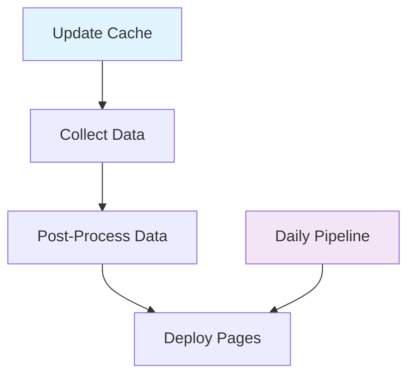

# Manual GitHub Actions Workflows

All LMIA Collector workflows support manual execution from the GitHub Actions UI for testing and administrative purposes.

## How to Trigger Manually

1. Navigate to **Actions** tab in GitHub repository
2. Select the desired workflow from the left sidebar
3. Click **"Run workflow"** button
4. Configure parameters (if available)
5. Click **"Run workflow"** to execute

## Available Workflows

### 🔄 **Collect Data Workflow**
**Purpose**: Download and convert raw LMIA data from government APIs

**Manual Trigger**: `workflow_dispatch`
**Parameters**:
- **Language**: `en` or `fr` (default: `en`)
- **Debug Mode**: Enable verbose logging (default: `false`)

**Use Cases**:
- Test data collection on demand
- Collect specific language data
- Debug collection issues

---

### 🏭 **Daily Pipeline Workflow** 
**Purpose**: Complete end-to-end LMIA data processing pipeline

**Manual Trigger**: `workflow_dispatch`
**Parameters**:
- **Language**: `en` or `fr` (default: `en`)
- **Sleep Timer**: Seconds between geocoding API calls (default: `1`)
- **Force Cache Update**: Update cache regardless of missing postal codes (default: `false`)

**Use Cases**:
- Run complete pipeline on demand
- Test full workflow with custom settings
- Emergency data updates

---

### 📊 **Post-Process Data Workflow**
**Purpose**: Add postal code coordinates to collected CSV files

**Manual Trigger**: `workflow_dispatch`
**Parameters**:
- **Sleep Timer**: Seconds between geocoding API calls (default: `1`)
- **Force Processing**: Process even if files already exist (default: `false`)
- **Debug Mode**: Enable verbose logging (default: `false`)

**Use Cases**:
- Reprocess files with geocoding
- Test geocoding performance
- Add coordinates to specific datasets

---

### 🗃️ **Update Cache Workflow**
**Purpose**: Build/update postal code location cache

**Manual Trigger**: `workflow_dispatch`
**Parameters**:
- **Sleep Timer**: Seconds between API calls (default: `1`)
- **Force Update**: Update cache even if it exists (default: `false`)

**Use Cases**:
- Build cache from scratch
- Update cache with new postal codes
- Test cache performance

---

### 📄 **Deploy Pages Workflow**
**Purpose**: Deploy web interface to GitHub Pages

**Manual Trigger**: `workflow_dispatch`
**Parameters**: None

**Use Cases**:
- Force deploy after manual changes
- Test deployment process
- Update web interface immediately

---

### ⚠️ **Process LMIA Workflow** (DEPRECATED)
**Purpose**: Legacy workflow (use Daily Pipeline instead)

**Manual Trigger**: `workflow_dispatch`
**Parameters**:
- **Debug Mode**: Enable verbose logging (default: `false`)
- **Language**: `en` or `fr` (default: `en`)

**Use Cases**:
- Legacy compatibility only
- **Recommended**: Use Daily Pipeline instead

## Performance Tips

### Geocoding Rate Limits
- **Fast Testing**: Use `sleep_timer: 0.1` (100ms)
- **Production**: Use `sleep_timer: 1` (1 second) to respect API limits
- **Conservative**: Use `sleep_timer: 2` for large datasets

### Cache Optimization
- Run **Update Cache** workflow first to build postal code cache
- Post-processing will be much faster with populated cache
- Cache hits = instant lookup vs 1+ second API calls

### Debug Mode
- Enable for troubleshooting failed runs
- Shows detailed processing information
- May significantly increase log output

## Workflow Dependencies



**Recommended Sequence**:
1. **Update Cache** (if cache is empty/outdated)
2. **Collect Data** (download raw files)  
3. **Post-Process Data** (add coordinates)
4. **Deploy Pages** (update web interface)

**Or use**:
- **Daily Pipeline** (runs steps 1-4 automatically)

## Common Administrative Tasks

### Emergency Data Update
```bash
# 1. Trigger Daily Pipeline with fast settings
Language: en
Sleep Timer: 0.5
Force Cache Update: true
```

### Performance Testing
```bash
# 1. Update Cache (fast)
Sleep Timer: 0.1

# 2. Post-Process Data (fast)
Sleep Timer: 0.1
Force Processing: true
Debug Mode: true
```

### Troubleshooting Collection Issues
```bash
# 1. Collect Data (debug mode)
Language: en
Debug Mode: true
```

## Monitoring

- **Actions Tab**: View real-time workflow execution
- **Logs**: Download detailed execution logs
- **Artifacts**: Access generated files and reports
- **Status Badges**: Monitor workflow health on README

All workflows generate comprehensive logs for debugging and monitoring purposes.
